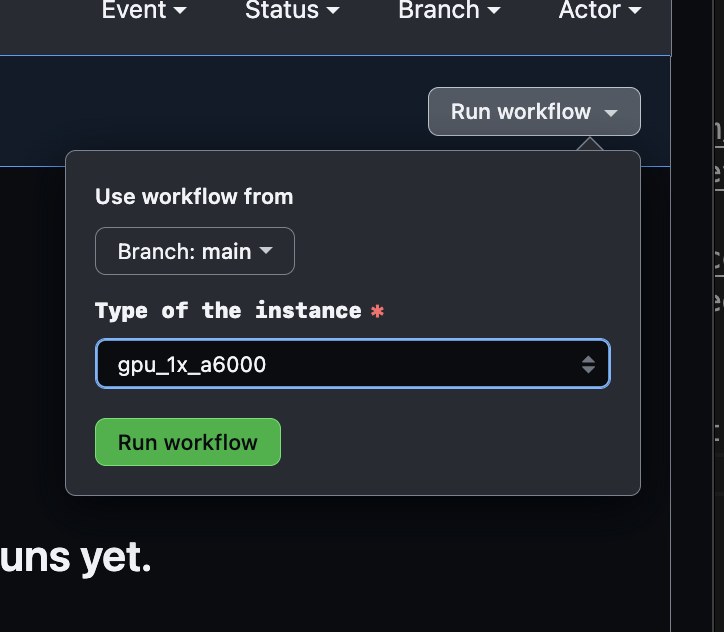

# Get Lambda Instances

Use GitHub Actions to get the lambda cloud instances you want. Forked from https://github.com/hamelsmu/get-lambda/

## Usage

1. Setup a new [ssh key in lambda](https://cloud.lambdalabs.com/ssh-keys) named `lambda-sshkey`.  And save the private key locally. You will need the private key to ssh into the instance after it is created.

2. Add your Lambda [cloud token](https://cloud.lambdalabs.com/api-keys) as a new [repository secret](https://docs.github.com/en/actions/security-guides/encrypted-secrets) named `LAMBDA_CLOUD_TOKEN`. Add another secret named `LAMBDA_SSH_KEY_NAME` and set its value to `lambda-sshkey`

3. Go to your Actions tab and enable workflows if they aren't already enabled.  Then click on the `Create Instance` workflow and select the kind of GPU that works for you:

